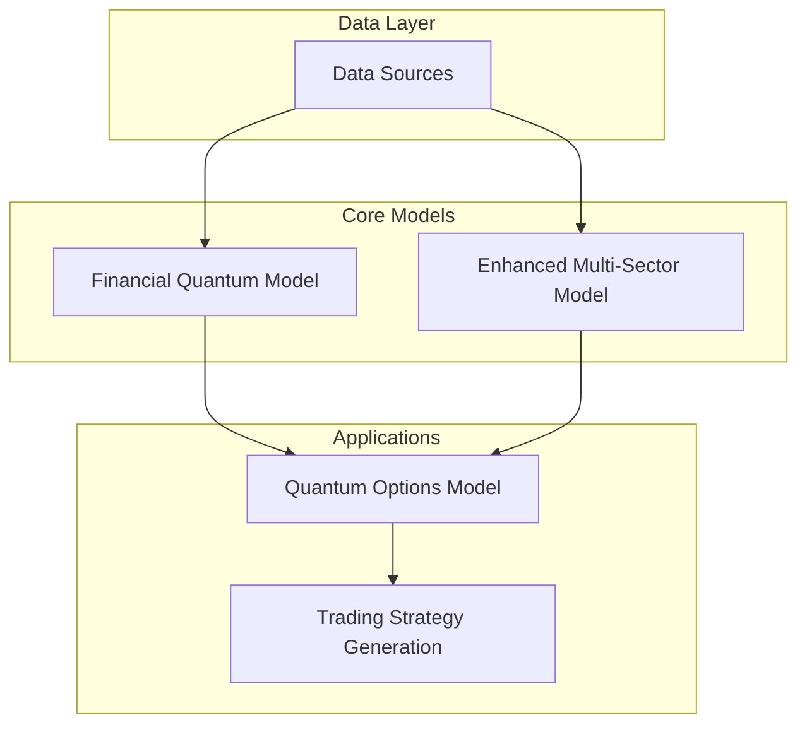
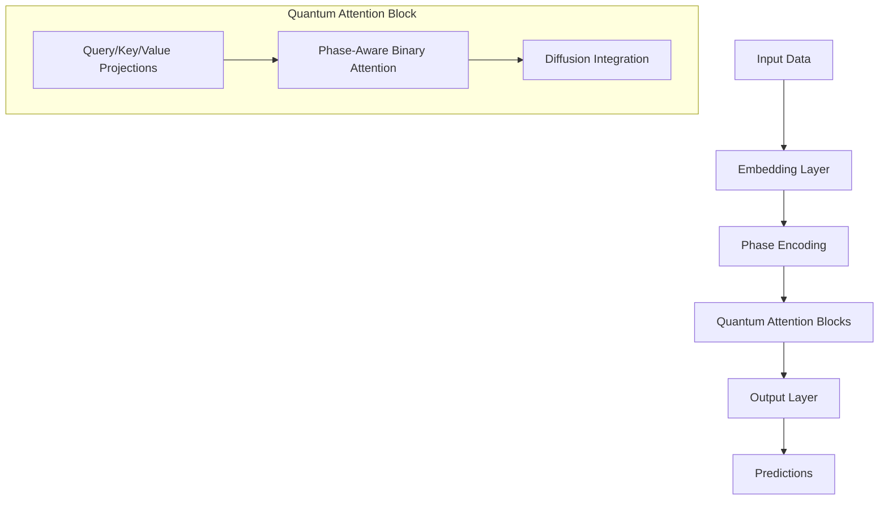

# Multi-Sector Options Forecast Model: Comprehensive Documentation

## Table of Contents
1. [Introduction](#introduction)
2. [System Architecture](#system-architecture)
3. [Core Components](#core-components)
   - [Financial Quantum Model](#financial-quantum-model)
   - [Enhanced Multi-Sector Model](#enhanced-multi-sector-model)
   - [Quantum Options Model](#quantum-options-model)
4. [Data Requirements](#data-requirements)
5. [Simulation Workflow](#simulation-workflow)
6. [Model Training](#model-training)
7. [Evaluation Metrics](#evaluation-metrics)
8. [Trading Strategy Generation](#trading-strategy-generation)
9. [Simulating Real Market Conditions](#simulating-real-market-conditions)
10. [Implementation Requirements](#implementation-requirements)
11. [Future Enhancements](#future-enhancements)

## Introduction

The Multi-Sector Options Forecast Model is a sophisticated financial modeling framework that combines quantum-inspired neural networks with traditional financial models. The system is designed to forecast market movements across multiple sectors and generate options trading strategies that can exploit market inefficiencies.

The framework consists of three main components:
1. A base financial quantum model for time series forecasting
2. An enhanced multi-sector model that captures cross-sector dynamics
3. A quantum options model that leverages the forecasts to price options and detect arbitrage opportunities

By integrating quantum computing principles with financial theory, the system aims to identify patterns in market data that traditional models might miss, potentially leading to more accurate predictions and profitable trading strategies.

## System Architecture

The system follows a hierarchical architecture:



1. **Data Layer**: Collects and preprocesses financial data from various sources
2. **Core Models**: Implements quantum-inspired neural networks for time series forecasting
3. **Applications**: Applies the model predictions to options pricing and strategy generation

## Core Components

### Financial Quantum Model

The base model implements a Xi/Psi Quantum Field Neural Network for financial time series prediction.

#### Key Features:
- **Phase Space Encoding**: Maps financial data to phase space representation using quantum-inspired techniques
- **Hebbian Learning**: Implements "neurons that fire together, wire together" learning rule
- **Quantum Attention**: Uses phase-aware binary attention mechanisms to capture temporal dependencies
- **Causal Structure**: Respects the causal nature of financial time series

#### Architecture:



#### Key Components:

1. **HebbianLinear Layer**: Implements Hebbian learning for weight updates without traditional backpropagation
   ```python
   class HebbianLinear(nn.Module):
       def __init__(self, in_features, out_features, hebbian_lr=0.01, decay_rate=0.999):
           super().__init__()
           self.weight = nn.Parameter(torch.randn(out_features, in_features) * 0.02, requires_grad=False)
           self.bias = nn.Parameter(torch.zeros(out_features), requires_grad=False)
           self.hebbian_lr = hebbian_lr
           self.decay_rate = decay_rate
   ```

2. **PhaseAwareBinaryAttention**: Creates attention weights based on phase relationships
   ```python
   class PhaseAwareBinaryAttention(nn.Module):
       def __init__(self, threshold_factor=1.25):
           super().__init__()
           self.threshold_factor = threshold_factor
   ```

3. **QuantumAttentionBlock**: Combines quantum projections with attention mechanism
   ```python
   class QuantumAttentionBlock(nn.Module):
       def __init__(self, embedding_dim, hebbian_lr=0.01, decay_rate=0.999):
           super().__init__()
           self.embedding_dim = embedding_dim
           # Hebbian projections for Q, K, V
           self.query_proj = HebbianLinear(embedding_dim, embedding_dim, hebbian_lr, decay_rate)
           self.key_proj = HebbianLinear(embedding_dim, embedding_dim, hebbian_lr, decay_rate)
           self.value_proj = HebbianLinear(embedding_dim, embedding_dim, hebbian_lr, decay_rate)
   ```

### Enhanced Multi-Sector Model

Extends the base model to handle multiple market sectors and incorporate more sophisticated quantum-inspired techniques.

#### Key Enhancements:
- **Fibonacci Modular Spiral Patterns**: Uses golden ratio-based embedding for features
- **Quantum Diffusion**: Implements RK2 integration for quantum state evolution
- **Physics-Informed Loss Functions**: Combines traditional MSE with quantum state properties
- **Cross-Sector Correlations**: Captures relationships between different market sectors

#### Key Components:

1. **PhaseHebbianEmbedder**: Maps financial features to phase space using Fibonacci patterns
   ```python
   class PhaseHebbianEmbedder(nn.Module):
       def __init__(self, feature_dim):
           super().__init__()
           # Create Fibonacci modular spiral embedding
           indices = torch.arange(feature_dim).float()
           r = (PHI * indices) % 1.0  # Fibonacci modular mapping
           theta = 2 * np.pi * r      # Convert to angle
           x = r * torch.cos(theta)    # x-coordinate
           y = r * torch.sin(theta)    # y-coordinate
           emb = torch.stack([x, y], dim=1)
           self.embedding = nn.Parameter(emb, requires_grad=False)
   ```

2. **RadialDiffusionIntegrator**: Implements quantum diffusion while preserving state norms
   ```python
   class RadialDiffusionIntegrator(nn.Module):
       def __init__(self, dt=0.1, steps=3):
           super().__init__()
           self.dt = dt        # Time step size
           self.steps = steps  # Number of integration steps
   ```

3. **HarmonyLoss**: Combines MSE with quantum coherence metrics
   ```python
   class HarmonyLoss(nn.Module):
       def __init__(self, λ_mse=1.0, λ_coherence=0.3, λ_drift=0.2, λ_entropy=0.5):
           super().__init__()
           self.λ_mse = λ_mse                # Weight for MSE loss
           self.λ_coherence = λ_coherence    # Weight for coherence loss
           self.λ_drift = λ_drift            # Weight for drift loss
           self.λ_entropy = λ_entropy        # Weight for entropy loss
   ```

### Quantum Options Model

Extends the framework to options pricing and strategy generation.

#### Key Features:
- **Black-Scholes Integration**: Combines traditional option pricing with quantum enhancements
- **Volatility Surface Modeling**: Uses quantum neural networks to predict implied volatility
- **Arbitrage Detection**: Identifies pricing discrepancies across strikes and expirations
- **Multi-Timeframe Strategies**: Generates trading strategies across different time horizons

#### Key Components:

1. **QuantumVolatilitySurface**: Neural network for predicting implied volatility
   ```python
   class QuantumVolatilitySurface(nn.Module):
       def __init__(self, input_dim, hidden_dim=64, output_dim=1, num_quantum_layers=3):
           super(QuantumVolatilitySurface, self).__init__()
           self.input_dim = input_dim
           self.hidden_dim = hidden_dim
           self.output_dim = output_dim
   ```

2. **Options Pricing Functions**: Black-Scholes model implementation
   ```python
   def bs_call_price(S, K, r, sigma, T):
       """Calculate call option price using Black-Scholes formula"""
       if T <= 0 or sigma <= 0:
           return max(0, S - K)
       
       d1 = d1_formula(S, K, r, sigma, T)
       d2 = d2_formula(d1, sigma, T)
       
       return S * stats.norm.cdf(d1) - K * math.exp(-r * T) * stats.norm.cdf(d2)
   ```

3. **Option Greeks Calculation**: Computes option sensitivities
   ```python
   def calc_option_greeks(S, K, r, sigma, T, option_type='call'):
       """Calculate option greeks"""
       # Implementation details for delta, gamma, theta, vega, rho
   ```

## Data Requirements

To effectively run the model and simulate real market conditions, the following data sources are required:

1. **Market Data**:
   - Historical price data for sector indices (S&P 500, Energy, Technology, etc.)
   - Trading volume and volatility metrics
   - Options chain data with strike prices and expirations

2. **Economic Indicators**:
   - Unemployment rate (UNRATE)
   - Consumer Price Index (CPIAUCSL)
   - Federal Funds Rate (FEDFUNDS)
   - Industrial Production Index (INDPRO)
   - Money Supply (M2SL)
   - Treasury Yields (GS10)
   - Housing Starts (HOUST)
   - Oil Prices (DCOILWTICO)

3. **Company-Specific Data** (for sector analysis):
   - Earnings reports
   - Financial statements
   - Analyst forecasts

4. **Options Market Data**:
   - Historical option prices
   - Implied volatility surfaces
   - Open interest and volume

## Simulation Workflow

To simulate real market conditions, the system follows this workflow:

1. **Data Collection and Preprocessing**:
   ```python
   # Load sector data
   sector_data = load_sector_indices(start_date, end_date)
   
   # Load economic indicators
   economic_data = load_economic_indicators(start_date, end_date)
   
   # Load option data for target sectors
   option_data = load_option_data(target_sectors, start_date, end_date)
   ```

2. **Feature Engineering**:
   ```python
   # Prepare multi-sector dataset
   train_dataset, test_dataset, scaler, dates, feature_metadata = prepare_multi_sector_dataset(
       sector_data, economic_data, target_sector=target_sector,
       sequence_length=seq_length, forecast_horizon=forecast_horizon, 
       test_split=test_split
   )
   ```

3. **Model Training**:
   ```python
   # Train sector models
   sector_models = model.prepare_sector_models(target_sectors=['S&P500', 'Energy'])
   
   # Train volatility model
   vol_model = model.train_volatility_model(target_sectors=['S&P500', 'Energy'])
   ```

4. **Strategy Generation**:
   ```python
   # Generate trading strategy
   strategy = model.generate_trading_strategy('S&P500', current_price)
   ```

5. **Backtesting and Evaluation**:
   ```python
   # Evaluate model performance
   test_results = evaluate_enhanced_model(model, test_loader, dates_test, feature_metadata)
   ```

## Model Training

The training process involves multiple stages:

1. **Sector Model Training**:
   - Uses historical sector data and economic indicators
   - Employs phase-coherent learning with Hebbian updates
   - Monitors coherence metrics during training
   - Implements early stopping to prevent overfitting

2. **Volatility Surface Model Training**:
   - Uses option data across multiple timeframes
   - Implements quantum attention mechanisms
   - Optimizes for accurate implied volatility prediction

3. **Hyperparameter Optimization**:
   - Learning rate scheduling
   - Decay rate tuning
   - Quantum diffusion parameters adjustment
   - Loss function weight balancing

## Evaluation Metrics

The system uses several metrics to evaluate performance:

1. **Financial Prediction Metrics**:
   - Mean Squared Error (MSE)
   - Root Mean Squared Error (RMSE)
   - Mean Absolute Error (MAE)
   - Directional Accuracy (% of correct up/down predictions)
   - R² Score

2. **Quantum State Metrics**:
   - Phase Coherence
   - Wave Function Collapse
   - Energy Levels
   - Quantum Drift

3. **Options Trading Metrics**:
   - Implied Volatility Accuracy
   - Option Price Error
   - Greeks Accuracy
   - PnL of Trading Strategies
   - Sharpe Ratio

## Trading Strategy Generation

The system generates trading strategies based on:

1. **Directional Predictions**:
   - Market trend forecasts from sector models
   - Confidence levels for each prediction

2. **Volatility Surface Analysis**:
   - Identifies mispriced options across strike prices
   - Detects term structure anomalies

3. **Arbitrage Opportunities**:
   - Compares model prices with market prices
   - Identifies statistical arbitrage opportunities

4. **Position Recommendations**:
   - Option type (calls/puts)
   - Strike selection
   - Expiration timeframes
   - Position sizing

Example strategy output:
```
S&P500 Trading Strategy:
- Direction: Up
- Confidence: 0.72
- Strategy: Multi-timeframe options positioning
- Positions:
  * CALL 5250.00 7d - Buy @ 125.75
  * PUT 4750.00 30d - Sell @ 87.50
  * CALL 5500.00 180d - Buy @ 245.30
```

## Simulating Real Market Conditions

To accurately simulate real market conditions, the following factors need to be incorporated:

1. **Market Frictions**:
   - Transaction costs (commissions, spreads)
   - Slippage in execution
   - Market impact of trades

2. **Volatility Regime Changes**:
   - Calm vs. turbulent market periods
   - Volatility clustering
   - Regime switching models

3. **Liquidity Constraints**:
   - Bid-ask spreads in options markets
   - Open interest and volume limitations
   - Early exercise possibilities

4. **Market Shocks**:
   ```python
   def decoherence_shock(psi, beta=0.03, threshold=0.5):
       """
       Apply random perturbation to quantum states with high entropy
       """
       entropy = -torch.sum(psi * torch.log(torch.clamp(torch.abs(psi), min=EPSILON)), dim=-1)
       mask = (entropy > threshold).unsqueeze(-1).float()
       shock = beta * torch.randn_like(psi)
       return psi + mask * shock
   ```

5. **Correlation Regime Changes**:
   - Cross-sector correlation dynamics
   - Correlation breakdowns during market stress

## Implementation Requirements

To implement and run this system, the following are required:

### Software Requirements:
- Python 3.8+
- PyTorch 1.8+
- NumPy, Pandas, SciPy
- Matplotlib, Seaborn for visualization
- YFinance or similar for market data
- Scikit-learn for preprocessing and evaluation

### Hardware Requirements:
- Recommended: CUDA-compatible GPU for faster training
- Minimum 16GB RAM
- Sufficient storage for historical data

### Data APIs:
- FRED API for economic data
- Market data provider (Alpha Vantage, Yahoo Finance, etc.)
- Options data provider (CBOE, OptionMetrics, etc.)

### Sample Implementation:
```python
# Initialize the model
model = QuantumOptionsModel(
    risk_free_rate=0.03,
    sector_model_params={
        'hidden_dim': 64,
        'num_layers': 3
    },
    quantum_vol_params={
        'hidden_dim': 96,
        'num_quantum_layers': 4
    }
)

# Load data
model.load_data(start_date='2019-01-01', target_sectors=['S&P500', 'Energy'])

# Prepare sector models
sector_models = model.prepare_sector_models(target_sectors=['S&P500', 'Energy'])

# Train volatility model
vol_model = model.train_volatility_model(target_sectors=['S&P500', 'Energy'])

# Generate trading strategy
sp500_strategy = model.generate_trading_strategy('S&P500', current_price)
```

## Future Enhancements

The system can be extended with the following enhancements:

1. **Quantum Computing Integration**:
   - Implementation on quantum hardware
   - Quantum circuit-based optimization

2. **Advanced Market Simulations**:
   - Agent-based market simulations
   - Stress testing under extreme market conditions

3. **Multi-Asset Integration**:
   - Include fixed income, currencies, commodities
   - Cross-asset correlation modeling

4. **Alternative Data Sources**:
   - News sentiment analysis
   - Social media data integration
   - Satellite imagery for economic indicators

5. **Risk Management Enhancements**:
   - Position sizing optimization
   - Portfolio-level risk constraints
   - Value at Risk (VaR) calculations

---

This comprehensive documentation outlines the architecture, components, and requirements for implementing and running the Multi-Sector Options Forecast Model. By following these guidelines, it's possible to create a sophisticated trading system that leverages quantum-inspired algorithms to identify market opportunities across multiple sectors and timeframes.
