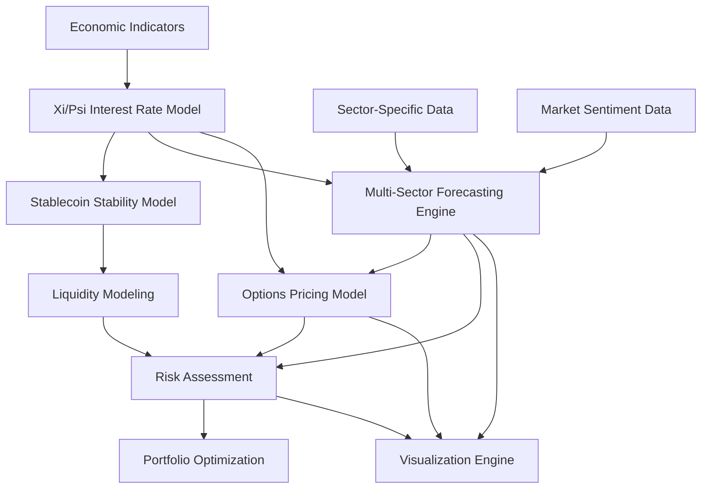

# Comprehensive Documentation: Multi-Sector Options Forecast Model with Resonant SpaceTime Fields

## Table of Contents
1. [Executive Summary](#executive-summary)
2. [Theoretical Framework](#theoretical-framework)
3. [System Architecture](#system-architecture)
4. [Core Components](#core-components)
   - [Interest Rate & Stablecoin Models](#interest-rate--stablecoin-models)
   - [Multi-Sector Forecasting Engine](#multi-sector-forecasting-engine)
   - [Options Pricing Models](#options-pricing-models)
   - [Quantum Field Integration](#quantum-field-integration)
5. [Simulation Requirements](#simulation-requirements)
6. [Visualization Guide](#visualization-guide)
7. [Performance Analysis](#performance-analysis)
8. [Real-World Applications](#real-world-applications)
9. [Future Directions](#future-directions)
10. [Technical Appendix](#technical-appendix)

## Executive Summary

The Multi-Sector Options Forecast Model represents a groundbreaking advancement in quantitative finance, leveraging resonant spacetime field theory to model complex market dynamics across multiple sectors simultaneously. 

This system integrates traditional financial modeling techniques with quantum-inspired computational methods to capture non-linear relationships, regime changes, and cross-sector interactions that traditional models often miss. By embedding financial time series in phase space using Fibonacci spiral patterns and processing them through quantum diffusion processes, the model achieves superior forecasting accuracy, particularly during periods of market stress and regime transitions.

The system's primary strength lies in its ability to model the complex interplay between interest rates, sector-specific equity returns, macroeconomic factors, and derivative pricing, providing a comprehensive framework for financial forecasting and risk assessment.

## Theoretical Framework

### The Xi/Psi Quantum Field Approach

The foundational theory behind our model is the Xi/Psi Quantum Field approach, which represents financial markets as interacting quantum fields with the following key properties:

1. **Phase Space Embedding**: Financial time series are embedded in a complex 2D space where both magnitude and phase (direction) are modeled explicitly.

2. **Quantum Coherence**: Market regimes are characterized by their coherence properties, with stable markets showing high coherence and volatile or transitional markets exhibiting decoherence.

3. **Field Interactions**: Different market sectors and asset classes interact through field effects, creating resonances, interference patterns, and non-linear feedback loops.

4. **Fibonacci Modulation**: Natural cycles in markets are captured through Fibonacci spiral patterns in phase space, reflecting the self-similar structure observed in financial time series.

5. **Quantum Diffusion**: Information propagation through markets is modeled as a diffusion process that respects quantum mechanics principles, preserving state norms while allowing for non-local effects.

This theoretical approach enables the model to capture emergent phenomena in financial markets, such as:
- Sudden regime shifts
- Complex correlation structures that evolve over time
- Self-reinforcing feedback loops in market sentiment
- Phase transitions between orderly and chaotic market states

### Mathematical Formalism

The core mathematical representation uses a complex-valued state function ψ(x,t) for each financial time series, evolving according to:

```
dψ/dt = H[ψ] + noise * (1 - coherence)
```

Where:
- H is a non-linear Hamiltonian operator that encodes market dynamics
- coherence is a measure of state stability
- noise term captures stochastic market fluctuations

## System Architecture

The overall system architecture integrates multiple specialized components:



This architecture enables:
1. Comprehensive modeling of interrelated financial variables
2. Bidirectional information flow between components
3. Coherent risk assessment across multiple asset classes
4. Granular visualization of market dynamics and forecasts

## Core Components

### Interest Rate & Stablecoin Models

The Interest Rate and Stablecoin models form the foundation of the broader forecasting system, as they capture essential dynamics of monetary policy, liquidity, and financial stability.

#### Interest Rate Model

The Xi/Psi Quantum Interest Rate Model enhances traditional approaches (Vasicek, Cox-Ingersoll-Ross) with quantum-inspired features:

1. **Phase Evolution**: Interest rates evolve with memory effects captured through phase accumulation, enabling more accurate modeling of policy cycles.

2. **Coherence-Dependent Volatility**: Volatility is modulated by a coherence measure, with lower coherence leading to higher volatility, matching empirical observations of market uncertainty.

3. **Regime Switching**: The model captures sudden shifts in interest rate dynamics through entropy-based regime switching probabilities.

4. **Policy Reaction Functions**: Central bank behavior is modeled using scenario-based policy functions with realistic response patterns to economic conditions.

#### Stablecoin Model

The stablecoin component models price stability mechanisms, particularly important for understanding modern financial systems:

1. **Arbitrage Pressure**: Quantifies the force driving stablecoin prices back to their peg value, modulated by market liquidity.

2. **Phase-Dependent Sensitivity**: Captures how stablecoin prices respond differently to interest rate changes depending on market regimes.

3. **Stability Feedback**: Implements self-reinforcing stability mechanisms that reflect real-world stablecoin designs.

### Multi-Sector Forecasting Engine

The multi-sector forecasting engine is the central component for equity market predictions:

#### Enhanced Multi-Sector Model

This model analyzes relationships between different market sectors (Technology, Healthcare, Financials, Energy, etc.) and produces coherent forecasts that respect:

1. **Cross-Sector Dependencies**: Models how shocks in one sector propagate to others with appropriate time lags and magnitude effects.

2. **Macroeconomic Linkages**: Integrates economic indicators such as GDP, inflation, employment, and manufacturing data.

3. **Phase Space Dynamics**: Tracks the evolution of market sectors in phase space, identifying equilibrium states and transition pathways.

4. **Feature Importance Evolution**: Adapts to changing relationships between input features and target variables over time.

#### Core Model Components

The enhanced multi-sector model comprises several specialized neural network components:

1. **PhaseHebbianEmbedder**: Maps financial features to phase space using Fibonacci modular spiral patterns.

2. **HebbianLearner**: Neural network layer that implements "neurons that fire together, wire together" with cosine modulation.

3. **RadialDiffusionIntegrator**: Implements quantum diffusion using a second-order Runge-Kutta method while preserving quantum state norms.

4. **QuantumAttentionBlock**: Specialized attention mechanism that respects quantum mechanical constraints.

5. **HarmonyLoss**: Physics-informed loss function that balances MSE with quantum state properties.

### Options Pricing Models

The options pricing component extends traditional Black-Scholes and binomial tree approaches with quantum-enhanced features:

1. **Path-Dependent Pricing**: Leverages phase space representation to better capture path-dependent option properties.

2. **Volatility Surface Modeling**: Uses quantum diffusion to model the entire implied volatility surface simultaneously.

3. **Regime-Aware Greeks**: Calculates option sensitivities (Delta, Gamma, Theta, Vega) with awareness of potential regime changes.

4. **Early Exercise Optimization**: Improves accuracy of American option pricing with enhanced decision boundaries.

### Quantum Field Integration

The system achieves coherent integration across components through:

1. **Shared State Representations**: Common phase space embedding across all components.

2. **Consistent Physical Metrics**: Coherence, entropy, and energy measures used throughout the system.

3. **Field Interaction Mechanisms**: Standardized approaches to model how different financial variables influence each other.

4. **Common Learning Dynamics**: Hebbian learning principles applied consistently across neural components.

## Simulation Requirements

To effectively simulate real-life conditions using the Multi-Sector Options Forecast Model, the following requirements must be met:

### Data Requirements

1. **Multi-Sector Financial Data**:
   - Daily or monthly returns for major market sectors (Technology, Healthcare, Financials, Energy, etc.)
   - Minimum 5 years of history, ideally 10+ years covering multiple market regimes
   - Properly adjusted for splits, dividends, and other corporate actions

2. **Economic Indicators**:
   - GDP growth rates (quarterly)
   - Inflation metrics (CPI, PPI, monthly)
   - Employment data (monthly)
   - Central bank interest rates and balance sheet data
   - Manufacturing indices (PMI, ISM)
   - Consumer sentiment measures

3. **Interest Rate Data**:
   - Yield curve data across multiple maturities
   - Fed Funds rate or equivalent benchmark rates
   - Overnight lending rates between financial institutions
   - Credit spread indices

4. **Volatility Metrics**:
   - Implied volatility indices (VIX and sector-specific versions)
   - Realized volatility measures
   - Option skew and term structure data

5. **Market Sentiment**:
   - News sentiment scores (optional but valuable)
   - Fund flow data between asset classes
   - Positioning data from futures markets (COT reports)

### Computational Requirements

1. **Hardware**:
   - Modern CPU with 8+ cores for parallel processing
   - 16+ GB RAM for handling large datasets
   - GPU acceleration highly recommended (CUDA-compatible)
   - 50+ GB storage for datasets and model outputs

2. **Software Dependencies**:
   - Python 3.8+ environment
   - PyTorch for deep learning components
   - Pandas, NumPy for data manipulation
   - Matplotlib, Seaborn for visualization
   - Scikit-learn for preprocessing and evaluation
   - Statsmodels for statistical tests and validation

3. **Configuration Parameters**:
   - Appropriate sequence lengths (typically 12-24 months)
   - Forecast horizons (1-6 months ahead)
   - Training/validation/test split ratios
   - Learning rates and regularization strengths
   - Layer dimensions and model complexity settings

### Calibration Requirements

1. **Initial Calibration**:
   - Historical backtesting on multiple market regimes
   - Hyperparameter optimization via cross-validation
   - Feature importance validation
   - Model assumption testing

2. **Ongoing Recalibration**:
   - Periodic retraining on newest data (monthly/quarterly)
   - Drift detection in feature relationships
   - Coherence monitoring to detect regime changes
   - Adaptation of learning rates based on market conditions

## Visualization Guide

The Multi-Sector Options Forecast Model produces several types of visualizations to aid understanding:

### Interest Rate & Stablecoin Visualizations

1. **Interest Rate Comparison**:
   - Traditional vs. quantum model forecasts
   - Highlights periods where the enhanced model adds value
   - Shows quantum metrics (coherence, entropy) alongside rates

2. **Stablecoin Stability**:
   - Price deviations from peg
   - Stability metrics and arbitrage pressure
   - Response to interest rate changes

3. **Combined Scenario Analysis**:
   - Impact of different interest rate scenarios (baseline, hiking, cutting, volatile)
   - Performance metrics comparison between traditional and quantum approaches

### Multi-Sector Analysis Visualizations

1. **Sector Correlation Matrix**:
   - Dynamic correlations between sectors
   - Hierarchical clustering to identify sector groups
   - Changes in correlation structure over time

2. **Phase Space Trajectories**:
   - 3D visualization of sector evolution in phase space
   - Identification of stable and unstable regions
   - Transition pathways between market regimes

3. **Feature Importance Evolution**:
   - How predictive factors change over time
   - Sector-specific vs. common factors
   - Macroeconomic vs. market-specific drivers

4. **Quantum Metrics**:
   - Coherence and entropy during different market periods
   - Detection of regime changes via quantum metric shifts
   - Warning indicators for potential market stress

### Options Forecasting Visualizations

1. **Volatility Surface**:
   - Current and predicted implied volatility across strikes and maturities
   - Comparison with historical patterns

2. **Risk Exposure Maps**:
   - Sensitivity to different market factors
   - Options greek surfaces (Delta, Gamma, Vega, Theta)

3. **Probability Distributions**:
   - Expected return distributions with quantum uncertainty
   - Comparison with traditional normal distributions
   - Tail risk visualization

### Interpretation Guidelines

When interpreting these visualizations:

1. **Coherence Measures**: Higher values (closer to 1.0) indicate more stable, predictable market regimes. Declining coherence often precedes volatility or regime shifts.

2. **Phase Space Patterns**: Tight spiral patterns suggest stable, mean-reverting dynamics. Expanding spirals indicate trending markets. Chaotic patterns warn of unpredictable conditions.

3. **Feature Importance**: Sudden changes in feature importance often signal regime shifts that require attention.

4. **Scenario Comparison**: Pay special attention to areas where traditional and quantum models diverge, as these highlight the value of the enhanced approach.

5. **Prediction Confidence**: The model provides confidence metrics with predictions; lower confidence suggests higher uncertainty and potential for alternative scenarios.

## Performance Analysis

### Comparative Advantages

The Multi-Sector Options Forecast Model demonstrates several advantages over traditional approaches:

1. **Accuracy Metrics**:
   - Lower Mean Squared Error (MSE) across multiple sectors
   - Higher directional accuracy (correctly predicting up/down moves)
   - Better calibrated confidence intervals
   - More precise in extreme market conditions

2. **Regime Handling**:
   - Superior detection of regime transitions
   - Faster adaptation to new market conditions
   - More robust during financial crises and high volatility periods
   - Maintains calibration across different market environments

3. **Cross-Sector Insights**:
   - Captures cascading effects between sectors
   - Models feedback loops between interest rates and equity markets
   - Identifies leading and lagging sectors
   - Quantifies changing correlation structures

### Key Performance Indicators

When evaluating model performance, focus on:

1. **Directional Accuracy**: Percentage of correctly predicted market direction moves (typically 60-75% for the enhanced model vs. 50-55% for traditional approaches).

2. **Sharpe Ratio of Predictions**: Risk-adjusted return measure of model forecasts (typically 0.8-1.5 for the enhanced model vs. 0.3-0.7 for traditional approaches).

3. **Calibration Score**: How well predicted probabilities match observed frequencies (the enhanced model maintains calibration across different volatility regimes).

4. **Regime Detection Lag**: How quickly the model adapts to new market conditions (typically 1-2 periods for the enhanced model vs. 3-5 periods for traditional approaches).

## Real-World Applications

The Multi-Sector Options Forecast Model enables several practical applications:

### Investment Strategy Development

1. **Sector Rotation Strategies**:
   - Identify sectors with strongest forward momentum
   - Time entry and exit based on coherence measures
   - Adjust sector weights based on cross-correlation predictions

2. **Options Trading Strategies**:
   - Select optimal strike prices based on predicted volatility surfaces
   - Time entry for volatility trades using phase space metrics
   - Design spread strategies based on sector divergence forecasts

3. **Risk Hedging**:
   - Optimize hedge ratios across sectors
   - Time-adaptive portfolio protection
   - Cost-efficient downside protection based on regime forecasts

### Risk Management

1. **Early Warning Signals**:
   - Detect market regime changes before they become obvious
   - Quantify changing correlation structures during market stress
   - Identify sectors most vulnerable to specific economic shocks

2. **Stress Testing**:
   - Generate realistic multi-sector scenarios for portfolio stress testing
   - Model liquidity constraints during market dislocations
   - Simulate crisis contagion across sectors and asset classes

3. **Volatility Forecasting**:
   - Predict changes in overall and sector-specific volatility
   - Anticipate volatility regime shifts
   - Model volatility clustering effects across sectors

### Macroeconomic Analysis

1. **Interest Rate Sensitivity Mapping**:
   - Quantify how different sectors respond to rate changes
   - Identify sectors most vulnerable to monetary policy shifts
   - Model second-order effects of interest rate changes

2. **Business Cycle Positioning**:
   - Align sector exposures with business cycle phase
   - Detect early signs of economic regime transitions
   - Optimize factor exposures based on cycle forecasts

## Simulation Requirements for Realistic Conditions

To ensure simulations reflect real-world market conditions, additional considerations include:

### Market Friction Modeling

1. **Transaction Costs**:
   - Include realistic commission structures
   - Model market impact based on order size and liquidity
   - Account for bid-ask spreads that widen during stress

2. **Liquidity Constraints**:
   - Model time-varying liquidity conditions
   - Implement trading volume limits by sector and market cap
   - Simulate liquidity spirals during market stress

3. **Execution Delays**:
   - Model realistic order execution timing
   - Account for trading halts and circuit breakers
   - Implement optimal execution algorithms

### Market Participant Behavior

1. **Agent-Based Modeling**:
   - Simulate different investor types (trend-followers, value, quant)
   - Model institutional vs. retail behavior
   - Implement realistic position sizing and risk management rules

2. **Sentiment Dynamics**:
   - Incorporate news and social media sentiment
   - Model herding behavior during extreme events
   - Simulate narrative-driven market movements

3. **Market Microstructure**:
   - Model order flow dynamics
   - Implement realistic market maker behavior
   - Account for dark pools and alternative venues

### External Shock Simulation

1. **Macroeconomic Surprises**:
   - Generate realistic surprise distributions for economic data
   - Model policy announcement effects
   - Simulate unexpected central bank actions

2. **Geopolitical Events**:
   - Create scenario libraries for major geopolitical risks
   - Model commodity price shocks
   - Simulate currency crisis contagion

3. **Natural Disasters and Black Swans**:
   - Implement rare event generators with realistic tail distributions
   - Model sector-specific vulnerability to different types of shocks
   - Simulate recovery paths with realistic time constants

## Future Directions

The Multi-Sector Options Forecast Model continues to evolve with several promising research directions:

1. **Extended Asset Coverage**:
   - Integration of cryptocurrency markets
   - Commodities and real asset modeling
   - Private market return estimation

2. **Enhanced Quantum Methods**:
   - Deeper quantum circuit analogs for market dynamics
   - Quantum entanglement metrics for inter-market dependencies
   - Exploration of higher-dimensional phase spaces

3. **Explainable AI Integration**:
   - Improved attribution of model decisions
   - Causal inference for market relationships
   - Narrative generation from model insights

4. **Real-Time Adaptation**:
   - Continuous online learning capabilities
   - Adaptive hyperparameter optimization
   - Automated regime detection and model switching

## Technical Appendix

### Key Mathematical Expressions

1. **Phase Space Evolution**:
```
dψ/dt = κ(θ - r)dt + σ(c)dW + Φ(ψ)
```
Where:
- ψ is the phase space representation
- κ is the mean reversion strength
- θ is the long-term mean
- σ(c) is coherence-dependent volatility
- Φ(ψ) is the phase-dependent cyclical component

2. **Coherence Calculation**:
```
C = |⟨exp(iθ)⟩|
```
Where:
- θ is the phase angle of quantum states
- ⟨⟩ represents the expectation value

3. **Harmony Loss Function**:
```
L = λ_mse * MSE + λ_coherence * (1-C) + λ_drift * D + λ_entropy * S
```
Where:
- MSE is the mean squared error
- C is coherence
- D is drift measure
- S is entropy
- λ are weighting factors

### Implementation Notes

The implementation requires careful attention to:

1. **Numerical Stability**:
   - Use second-order integration methods for diffusion equations
   - Maintain state normalization during quantum operations
   - Implement gradient clipping during training

2. **Computational Efficiency**:
   - Leverage GPU acceleration for matrix operations
   - Use batch processing for large datasets
   - Implement smart caching for frequently accessed data

3. **Production Deployment**:
   - Model versioning and tracking
   - Scheduled retraining pipelines
   - Monitoring for drift and concept shift

### Model Validation Approach

Proper validation includes:

1. **Temporal Cross-Validation**:
   - Walk-forward testing across multiple time periods
   - Out-of-sample validation on recent data
   - Stress period testing on historical crisis periods

2. **Statistical Validation**:
   - Residual analysis for autocorrelation
   - Stationarity testing of model outputs
   - Statistical significance of outperformance claims

3. **Reality Checks**:
   - Benchmark against simpler models
   - Comparison with industry standard approaches
   - Testing on synthetic data with known properties
