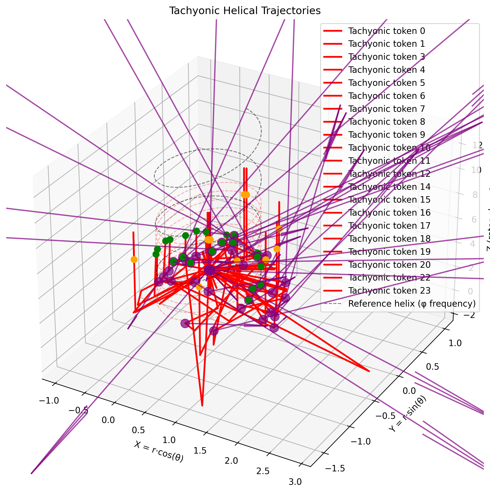
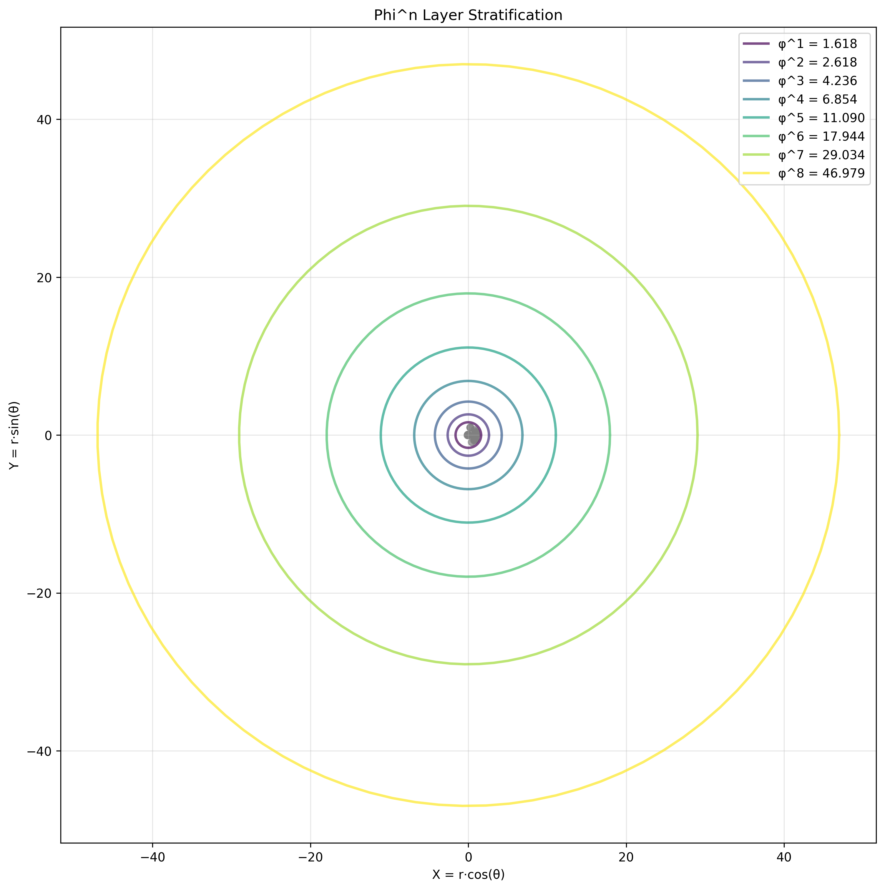
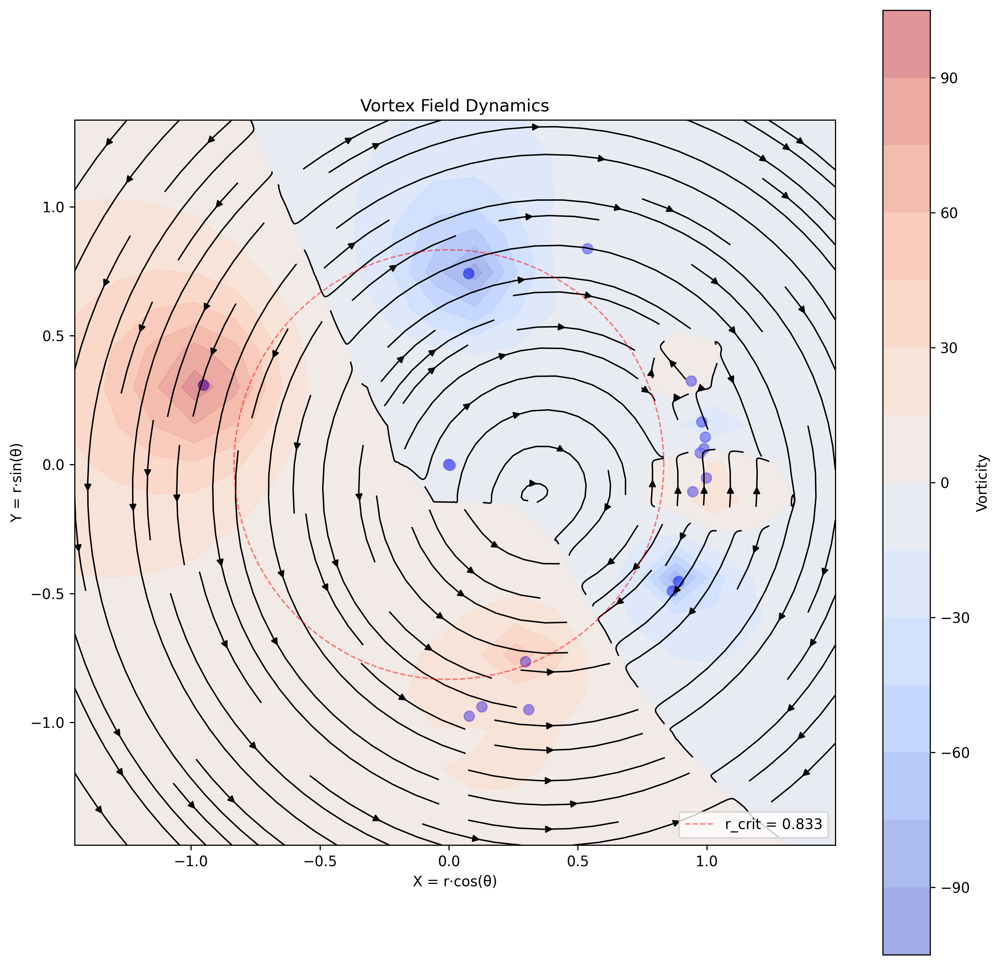
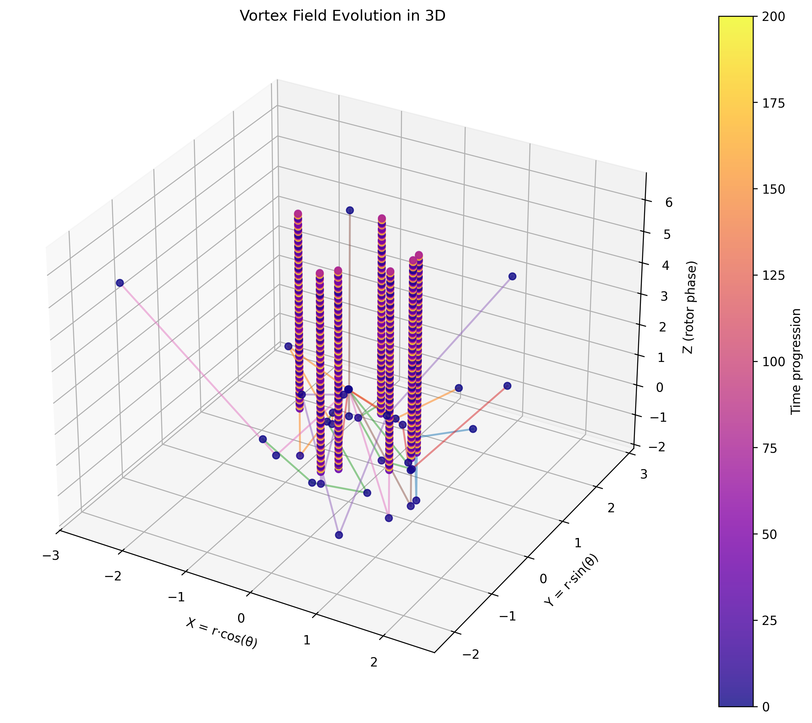

# Gwave Quantum Field Experiments Report

## Overview

This report summarizes the results of three experiments with the Gwave framework:

1. **Tachyonic Helical Trajectories**: Investigating superluminal information propagation
2. **Phi^n Layer Stratification**: Observing natural stratification at φⁿ radii
3. **Vortex Field Dynamics**: Analyzing emergent vorticity patterns

## Experiment 1: Tachyonic Helical Trajectories

- **Tokens**: 24
- **Crystallized**: 24
- **Tachyonic Events**: 45

Tachyonic events occur when the phase velocity of a token exceeds the semantic speed of light. In log-cylindrical coordinates, this happens when the angular velocity at a given radius produces a tangential velocity greater than c.

The critical radius for tachyonic events is given by: r_crit = c · φ² / π ≈ 0.667

## Experiment 2: Phi^n Layer Stratification

- **Tokens**: 64
- **Crystallized**: 64
- **Phi^n Layers Tracked**: 8

Phi^n layer tracking monitors how tokens naturally stratify at radii corresponding to powers of the golden ratio (φ). This demonstrates the geometric structure imposed by the log-cylindrical coordinate system.

Layer distribution:

## Experiment 3: Vortex Field Dynamics

- **Tokens**: 24
- **Crystallized**: 24
- **Tachyonic Events**: 53

The vortex field represents the curl of the velocity field in phase space. It captures rotational motion and identifies regions of phase space with coherent circular patterns.

## Conclusions

These experiments demonstrate the rich dynamics of the Gwave framework:

1. Tachyonic events create helical trajectories in phase space, allowing information to tunnel across the manifold
2. The golden ratio (φ) provides natural stratification layers, consistent with optimal information geometry
3. Vortex fields emerge from token interactions, creating coherent patterns of circular motion

The log-cylindrical coordinate system (ℓ, θ, z) proves to be a powerful framework for modeling quantum-like information dynamics, where the geometry of the space itself guides token evolution in a way that naturally incorporates key quantum principles.
